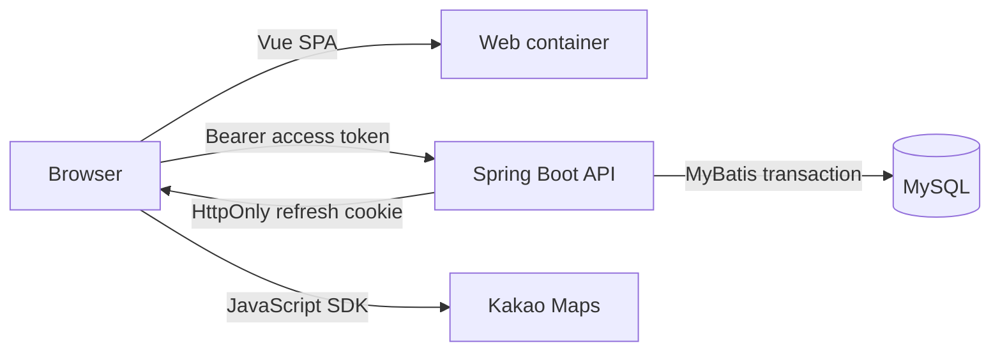

# 갈만할지도 (Theme Map)

사용자가 목적에 맞는 장소를 모아 **공개 또는 비공개 테마 지도**를 만들고, 공개 지도에는 다른 사용자가 장소를 제안할 수 있는 웹 서비스입니다. 검색 결과를 저장하는 데서 끝나지 않고 테마, 기여 한도, 좋아요, 평점을 하나의 협업 모델로 연결했습니다.

> 2023년 11월 SSAFY 1학기 과정에서 2인 팀으로 시작한 프로젝트입니다. 정준수는 팀원으로 구현에 참여했고, 2026년에는 본 저장소를 독립적으로 현대화하며 보안·데이터 정합성·테스트·실행 환경·문서를 보완했습니다.

[시연 영상](https://youtu.be/hzVyXYYJk6Q)


## 해결한 문제

- 공개 지도는 작성자 최대 **10개**, 다른 사용자는 최대 **1개**의 장소를 등록할 수 있습니다. Private 지도는 작성자만 수정합니다.
- 좋아요 관계와 테마·작성자 집계값을 한 트랜잭션에서 변경해 중간 실패로 수치가 어긋나는 상황을 막았습니다.
- 한 사용자가 같은 장소에 평점을 다시 주면 누적하지 않고 기존 평가를 갱신합니다.
- 테마 생성 ID는 DB 생성 키를 사용합니다. 동시 생성 시 다른 사용자의 ID를 반환할 수 있던 `MAX(id)` 조회를 제거했습니다.
- 요청의 사용자 ID를 신뢰하지 않고 JWT 주체를 DB 사용자로 해석한 뒤 소유권을 검사합니다.

## 기술 구성

| 영역 | 기술 |
| --- | --- |
| Web | Vue 3.5, Pinia 3, Vue Router 4, Axios 1.20, Vite 8 |
| API | Java 17, Spring Boot 3.5, Spring Security, MyBatis 3 |
| Data | MySQL 8.4, Flyway |
| Quality | JUnit 5, Mockito, Vitest, ESLint 10, Prettier |
| Delivery | Docker Compose, GitHub Actions, Dependabot |



## 실행

1. `.env.compose.example`을 `.env`로 복사합니다.
2. DB 비밀번호 두 개, 32바이트 이상의 JWT 비밀값, 도메인 제한을 건 Kakao JavaScript 키 URL을 입력합니다.
3. `docker compose up --build`를 실행합니다.
4. 웹은 `http://localhost:5173`, API 문서는 `http://localhost:8080/swagger-ui.html`에서 확인합니다.

Docker 없이 실행하려면 다음 명령을 사용합니다.

```bash
cd ThemeMap
DB_PASSWORD=... JWT_SECRET_KEY=... ./mvnw spring-boot:run

cd ../theme-map
cp .env.example .env
npm ci
npm run dev
```

## 검증

```bash
cd ThemeMap && ./mvnw clean verify
cd ../theme-map && npm ci && npm run lint && npm run test && npm run build
npm audit --audit-level=moderate
```

현재 검증 기준은 백엔드 **14개 테스트**, 프론트엔드 **2개 테스트**, ESLint 오류 0건, npm 알려진 취약점 0건입니다. CI도 같은 검사를 수행합니다.

## 문서

- [요구사항과 수용 기준](docs/REQUIREMENTS.md)
- [아키텍처와 데이터 흐름](docs/ARCHITECTURE.md)
- [API 명세](docs/API.md)
- [설계 결정 기록](docs/DECISIONS.md)
- [코드·기술 학습 가이드](docs/LEARNING_GUIDE.md)
- [현대화 결과와 검증 근거](docs/MODERNIZATION.md)
