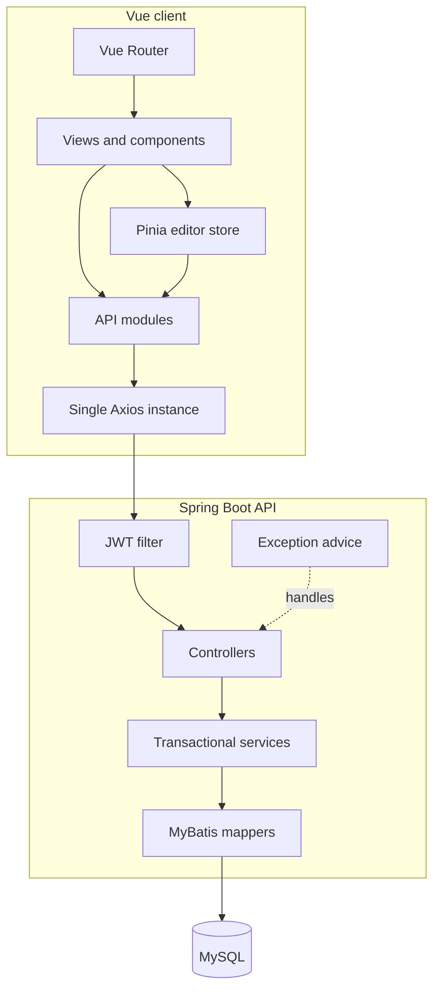
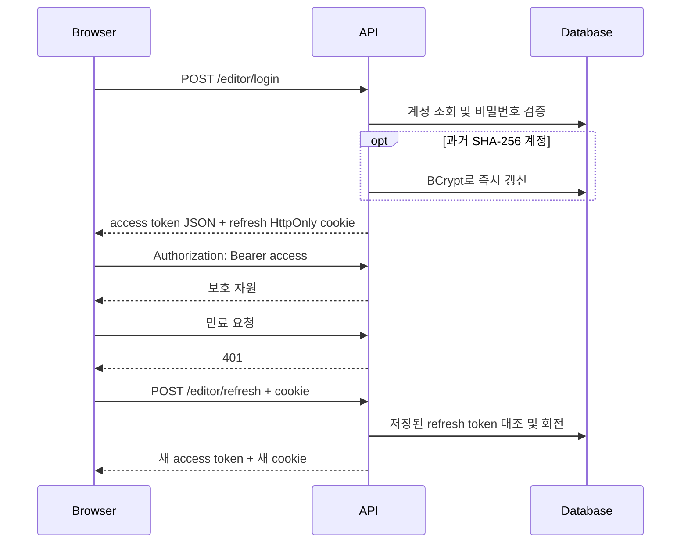
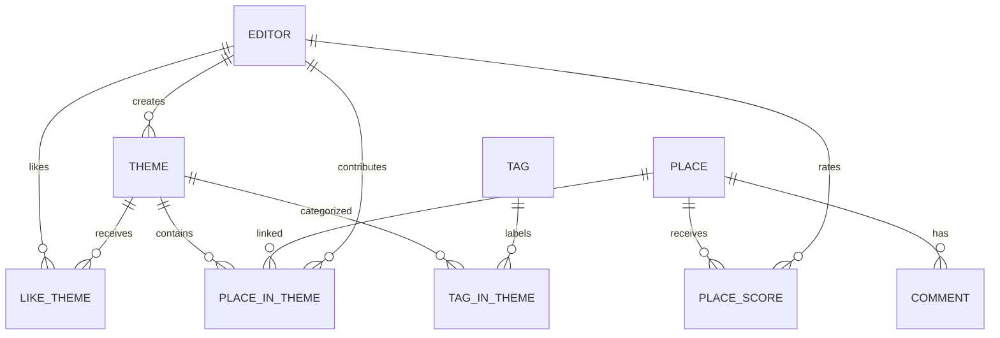

# 아키텍처와 데이터 흐름

## 구성

Controller는 HTTP 입력과 상태 코드만 담당합니다. 사용자 식별, 소유권, 기여 한도, 좋아요·평점 정합성은 서비스 계층에서 처리합니다. Mapper는 관계 삽입 여부처럼 서비스 판단에 필요한 영향 행 수를 반환합니다.

## 인증 흐름

프론트의 Axios 응답 인터셉터는 동시에 여러 401이 발생해도 하나의 갱신 요청을 공유합니다. 갱신 실패 시 메모리와 sessionStorage의 인증 상태를 함께 비웁니다.

## 정합성이 필요한 쓰기

좋아요는 `like_theme` 관계 삽입·삭제 결과가 1일 때만 `theme.like_sum`과 테마 작성자의 `editor.like_sum`을 바꿉니다. 세 연산은 하나의 트랜잭션이므로 일부만 반영되지 않습니다. DB의 복합 유일 키가 동시 중복 요청을 한 번 더 차단합니다.

평점은 `(place_id, editor_id)`를 기본 키로 가진 `place_score`에 upsert합니다. 이후 같은 트랜잭션에서 해당 장소의 합계와 평가자 수를 다시 계산합니다. 사용자가 평가를 수정해도 평가자 수가 늘지 않습니다.

장소 기여 한도와 권한은 요청 본문의 `editorId`를 사용하지 않습니다. JWT의 로그인 ID를 `EditorIdentity`가 내부 숫자 ID로 바꾸고, 테마 소유자와 기존 기여 수를 조회해 판단합니다.

## 데이터 모델

스키마는 `V1__create_base_schema.sql`에서 재현하며, 기존 2023 DB는 Flyway baseline 뒤 `V2__enforce_relations_and_ratings.sql`로 관계 중복 제거, 유일 제약, 사용자별 평점을 적용합니다.
